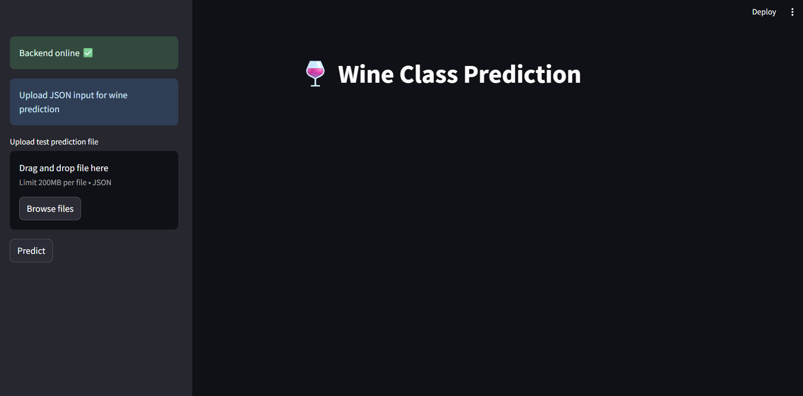

# Lab-1: FastAPI, Streamlit

## Overview

APIs using **FastAPI** and **uvicorn** two classic datasets and serving them through REST endpoints:

* 👀 **Iris Dataset**
* 🍷 **Wine Dataset**

1. Train a **Decision Tree Classifier** on each dataset.
2. Serve the trained model as an API.
3. Test the API using FastAPI’s interactive docs or tools like Postman.

---

## Setup

1. Create and activate a virtual environment:

   ```bash
   conda create -n lab-env python=3.10
   conda activate lab-env
   ```

2. Install requirements:

   ```bash
   pip install -r requirements.txt
   ```

---

## Project Structure

```
mlops-labs
└── lab-1
    ├── assets/
    │   └── dashboard.png
    ├── model/
    │   ├── iris_model.pkl
    │   └── wine_model.pkl
    ├── src-iris/
    │   ├── __init__.py
    │   ├── data.py
    │   ├── main.py
    │   ├── predict.py
    │   ├── train.py
    │   └── iris-readme.md
    ├── src-wine/
    │   ├── __init__.py
    │   ├── data.py
    │   ├── main.py
    │   ├── predict.py
    │   ├── train.py
    │   └── wine-readme.md
    ├── streamlit-lab/
    │   └── Dashboard.py
    └── requirements.txt
```
----

## Running the Labs

### Iris Classifier

1. Navigate to `src-iris`:

   ```bash
   cd src-iris
   ```

2. Train the model:

   ```bash
   python train.py
   ```

3. Serve the API:

   ```bash
   uvicorn main:app --reload
   ```

4. Test at: [http://127.0.0.1:8000/docs](http://127.0.0.1:8000/docs)

Example request:

```json
{
  "petal_length": 1.4,
  "sepal_length": 5.1,
  "petal_width": 0.2,
  "sepal_width": 3.5
}
```

---

### Wine Classifier🍷

1. Navigate to `src-wine`:

   ```bash
   cd src-wine
   ```

2. Train the model:

   ```bash
   python train.py
   ```

3. Serve the API:

   ```bash
   uvicorn main:app --reload
   ```

4. Test at: [http://127.0.0.1:8000/docs](http://127.0.0.1:8000/docs)

Example request:

```json
{
  "alcohol": 12.37,
  "malic_acid": 1.17,
  "ash": 1.92,
  "alcalinity_of_ash": 19.6,
  "magnesium": 78,
  "total_phenols": 2.11,
  "flavanoids": 2.0,
  "nonflavanoid_phenols": 0.27,
  "proanthocyanins": 1.04,
  "color_intensity": 4.68,
  "hue": 1.12,
  "od280_od315_of_diluted_wines": 3.48,
  "proline": 510
}

```
5. Run the Streamlit dashboard:

   ```bash
   cd ../streamlit-lab
   streamlit run Dashboard.py
   ```
---

## Key FastAPI Features Used

* **Automatic validation** with Pydantic models.
* **Interactive API docs** at `/docs`.
* **Request/response models** for schema clarity.
* **Error handling** with `HTTPException`.

## Streamlit Dashboard Features
* Sidebar for uploading JSON test files.
* Predict button to send requests to the FastAPI backend.
* Display predictions interactively with st.success / st.error.
* Placeholder container with st.empty to update prediction dynamically.
* Feedback with st.spinner during prediction.
--- 
### Dashboard Preview
