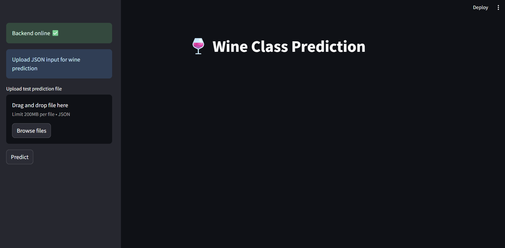
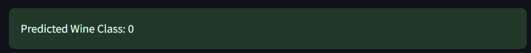

# Streamlit Lab – Wine Classification 🍷

## Introduction

We will build a Streamlit dashboard to interact with a Wine classification model. This builds upon your FastAPI lab, where the model is trained and hosted. Streamlit provides a user-friendly interface to showcase predictions interactively.

## Dashboard


---

## Lab Objective

* Use the trained `wine_model.pkl` from FastAPI Labs.
* Build a dashboard for uploading JSON input and displaying predictions.

---

## Setup

### 1. Create Virtual Environment

```bash
python3 -m venv streamlitenv
```

### 2.  Install Required Packages

```bash
pip install -r requirements.txt
```

*Alternative:*

```bash
pip install streamlit fastapi uvicorn scikit-learn
```

---

## Running the Lab

### 1. Start FastAPI Backend

From the `src-wine` folder:

```bash
uvicorn main:app --reload
```

### 2. Run Streamlit Dashboard

From the `streamlit-lab/src` folder:

```bash
streamlit run Dashboard.py
```

---

## Using the Dashboard

1. **Sidebar**

   * Upload a JSON file containing test features.
   * Click **Predict**.

2. **Body**

   * Displays the heading **Wine Classification! 🍷**
   * Shows predicted class after clicking **Predict**.

---

## Example JSON Input

```json
{
    "input_test": {
        "alcohol": 13.0,
        "malic_acid": 2.0,
        "ash": 2.4,
        "alcalinity_of_ash": 18.0,
        "magnesium": 100,
        "total_phenols": 2.0,
        "flavanoids": 2.0,
        "nonflavanoid_phenols": 0.3,
        "proanthocyanins": 1.5,
        "color_intensity": 5.0,
        "hue": 1.0,
        "od280_od315_of_diluted_wines": 3.0,
        "proline": 1000
    }
}
```
### Output


The lab produces a **single-page interactive dashboard** for Wine classification.

