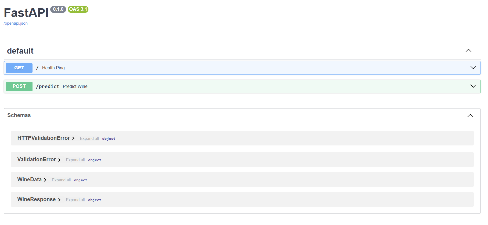
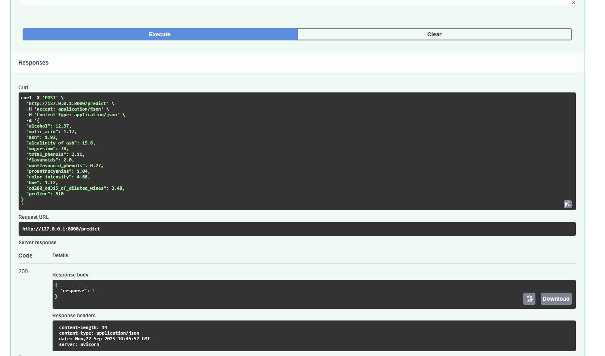

# FastAPI with Wine dataset 🍷 

## Overview

In this Lab, we will learn how to expose ML models as APIs using [FastAPI](https://fastapi.tiangolo.com/) and [uvicorn](https://www.uvicorn.org/).

1. **FastAPI**: A modern, high-performance web framework for building APIs with Python.
2. **Uvicorn**: An ASGI (Asynchronous Server Gateway Interface) web server implementation often used to serve FastAPI applications.

The workflow involves the following steps:

1. Training a **Decision Tree Classifier** on the **Wine Dataset**.
2. Serving the trained model as an API using FastAPI and uvicorn.

---

## Setting up the lab

1. Create a virtual environment (e.g. **lab-env**).

   ```bash
   conda create -n lab-env python=3.10
   conda activate lab-env
   ```

2. Install the required packages:

   ```bash
   pip install -r requirements.txt
   ```

---

## Project Structure

```
mlops-labs
└── lab-1
    ├── assets/
    ├── model/
    │   └── wine_model.pkl
    ├── src-wine/
    │   ├── __init__.py
    │   ├── data.py
    │   ├── main.py
    │   ├── predict.py
    │   └── train.py
    ├── wine-readme.md
    └── requirements.txt
```

> Note: **fastapi\[all]** in `requirements.txt` installs FastAPI plus optional dependencies including **uvicorn**.

---

## Running the Lab

1. Move into the **src-wine/** folder:

   ```bash
   cd src-wine
   ```

2. Train the Decision Tree Classifier:

   ```bash
   python train.py
   ```

   This saves the model in `../model/wine_model.pkl`.

3. Serve the trained model as an API:

   ```bash
   uvicorn main:app --reload
   ```

4. Test the API:

   * Interactive docs: [http://127.0.0.1:8000/docs](http://127.0.0.1:8000/docs)
   * Alternative: [http://localhost:8000/docs](http://localhost:8000/docs)

   Example request body for `/predict`:

   ```json
   {
    "alcohol": 12.37,
    "malic_acid": 1.17,
    "ash": 1.92,
    "alcalinity_of_ash": 19.6,
    "magnesium": 78,
    "total_phenols": 2.11,
    "flavanoids": 2.0,
    "nonflavanoid_phenols": 0.27,
    "proanthocyanins": 1.04,
    "color_intensity": 4.68,
    "hue": 1.12,
    "od280_od315_of_diluted_wines": 3.48,
    "proline": 510
    }
   ```

   Example response:

   ```json
   {
      "response": 1
   }
   ```

### API page



### API response


---

## FastAPI Syntax Recap

* Run with:

  ```bash
  uvicorn main:app --reload
  ```

* Endpoints are defined with decorators such as:

  ```python
  @app.get("/ping")
  @app.post("/predict")
  ```

* Data models with Pydantic validate and document the request/response schema.

---

## Data Models

### 1. `WineData` Request Model

```python
class WineData(BaseModel):
    alcohol: float
    malic_acid: float
    ash: float
    alcalinity_of_ash: float
    magnesium: float
    total_phenols: float
    flavanoids: float
    nonflavanoid_phenols: float
    proanthocyanins: float
    color_intensity: float
    hue: float
    od280_od315_of_diluted_wines: float
    proline: float
```

### 2. `WineResponse` Response Model

```python
class WineResponse(BaseModel):
    response: int
```

---

## Features

* **Request Body Reading & Validation** with Pydantic.
* **Response Models** for clean API docs.
* **Error Handling** with HTTPException.
