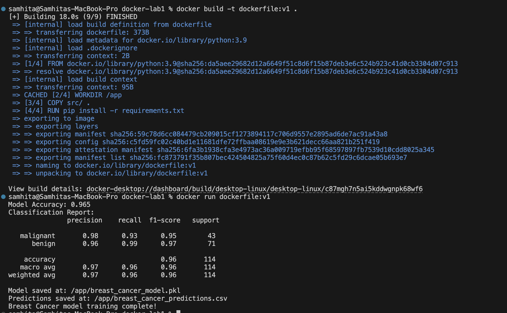

# Docker Lab 1:  Breast Cancer Random Forest Model 🐳

## Overview

This project demonstrates containerized machine learning using Docker. Key points:
- Uses the Breast Cancer Wisconsin dataset (binary classification, 30 numerical features).
- Trains a Random Forest Classifier.
- Saves the trained model and predictions to CSV.

---

### Changes made to lab

- **Dataset**: Replaced Iris dataset with Breast Cancer Wisconsin dataset.
- **Model**: Increased n_estimators to 150 and set max_depth=6.
- **Output**: Saves both the trained model and predictions CSV file.
- **File handling**: Uses Path(__file__).parent to save files in the same folder as the script.
- **Evaluation**: Prints model accuracy and a detailed classification report.
- **Libraries**: Added pandas for CSV output and pathlib for cleaner file paths.
-  **Print messages**: Detailed messages with file paths and accuracy for clarity.
---

## 🐳 Docker Instructions

### 1. Build the Docker Image

```bash
docker build --no-cache -t dockerfile:v1 .
```

### 2. Run the Container (save outputs locally)

```bash
docker run --rm -v $(pwd)/src:/app dockerfile:v1
```

**Note**: `-v $(pwd)/src:/app` ensures that the generated files (`breast_cancer_model.pkl` and `breast_cancer_predictions.csv`) are saved in your local `src/` folder. If you don't want to save it locally you can use the below code

```bash
docker run dockerfile:v1
```

---

## Outputs

After running, your `src/` folder should contain:

```
main.py
requirements.txt
breast_cancer_model.pkl
breast_cancer_predictions.csv
```

### Console Output:

```
Model Accuracy: 0.965
Classification Report:
               precision    recall  f1-score   support

   malignant       0.98      0.93      0.95        43
      benign       0.96      0.99      0.97        71

    accuracy                           0.96       114
   macro avg       0.97      0.96      0.96       114
weighted avg       0.97      0.96      0.96       114

Model saved at: /app/breast_cancer_model.pkl
Predictions saved at: /app/breast_cancer_predictions.csv
Breast Cancer model training complete!
```

---

## Output Screenshot


