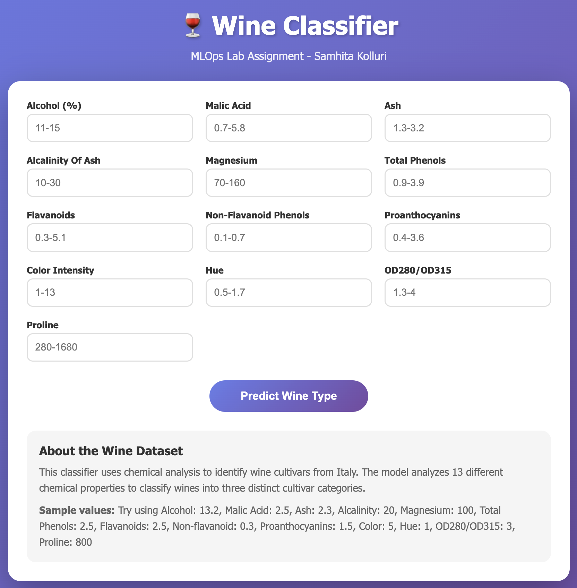

# Docker Lab 2: : Containerized ML Application for Wine classification 🍷 

## Overview
This project demonstrates containerized machine learning using Docker with a web-based interface. Key points:
- Uses the Wine dataset (multi-class classification, 13 chemical features)
- Trains a Deep Neural Network with TensorFlow/Keras
- Provides a modern web UI for real-time predictions
- Implements proper data preprocessing with StandardScaler
- Containerized using multi-stage Docker builds for efficiency

## Model Details
**Architecture**: Sequential Neural Network
```
┌─────────────────────────┐
│   Input Layer (13)      │
└────────────┬────────────┘
             ↓
┌─────────────────────────┐
│   Dense (32, ReLU)      │
│   Dropout (0.2)         │
└────────────┬────────────┘
             ↓
┌─────────────────────────┐
│   Dense (16, ReLU)      │
│   Dropout (0.2)         │
└────────────┬────────────┘
             ↓
┌─────────────────────────┐
│   Dense (8, ReLU)       │
└────────────┬────────────┘
             ↓
┌─────────────────────────┐
│   Output (3, Softmax)   │
└─────────────────────────┘
```

**Training Configuration:**
- **Optimizer**: Adam
- **Loss Function**: Sparse Categorical Crossentropy
- **Metrics**: Accuracy
- **Training**: 100 epochs with early stopping

## Docker Instructions

### Build the Docker Image
```bash
docker build -t app .
```

### Run the Container
```bash
docker run -p 4000:4000 app
```

### Access the Application
Open your browser and navigate to:
```
http://localhost:4000/predict
```
## Output Screenshots

### Wine Classifier UI

*Modern gradient interface with 13 chemical feature inputs*

### Prediction Results

*Shows predicted cultivar class with confidence scores and probability distribution*

## Author 🍷 
Samhita Kolluri