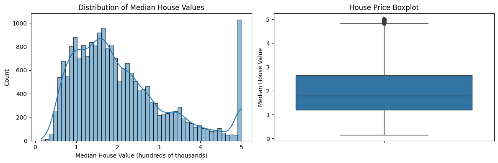
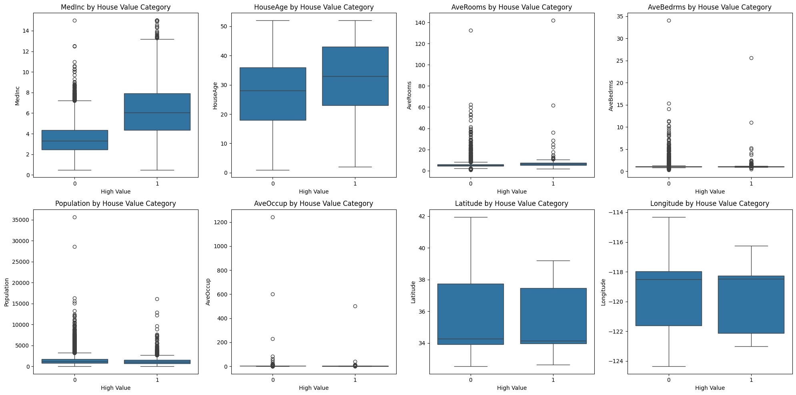
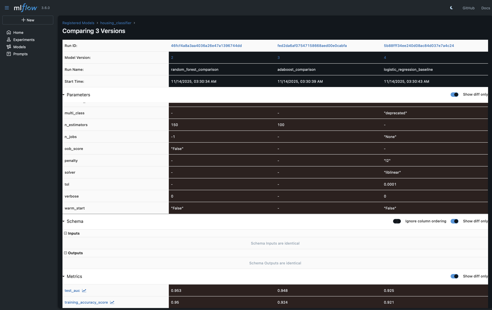
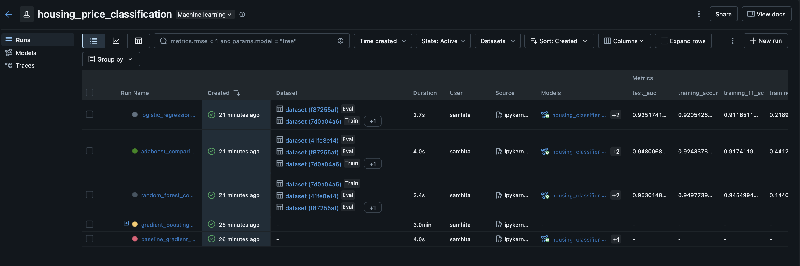
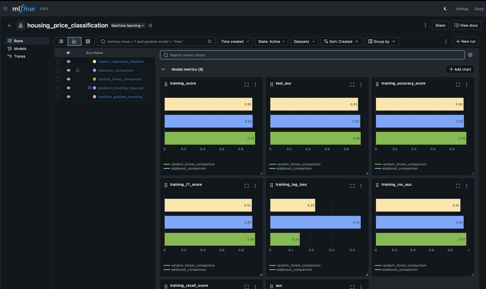

# Mlflow Lab : California Housing Price Prediction documentation

This documentation provides a comprehensive step-by-step guide to a machine learning lab focused on predicting California housing prices using Python. The lab covers data preprocessing, feature engineering, model training with hyperparameter optimization, model registration, comparison of multiple models, and deployment using MLflow.

## Prerequisites

Before starting the lab, ensure that you have the following:

- Python environment set up with required libraries installed
- MLflow installed and configured
- Jupyter Notebook or JupyterLab environment

## Installing Required Packages

First, we need to install all the necessary Python packages for our lab.

### Code:

```bash
!pip install mlflow scikit-learn xgboost hyperopt pandas numpy seaborn matplotlib pyspark ipykernel
```

### Output:
```
Requirement already satisfied: mlflow in ./mlflow_env/lib/python3.11/site-packages (3.6.0)
Requirement already satisfied: scikit-learn in ./mlflow_env/lib/python3.11/site-packages (1.7.2)
...
```

### Explanation:
This command installs all the required packages including:
- `mlflow`: For experiment tracking and model management
- `scikit-learn`: For machine learning algorithms and the California Housing dataset
- `xgboost`: For gradient boosting models
- `hyperopt`: For hyperparameter optimization
- `pandas` and `numpy`: For data manipulation
- `seaborn` and `matplotlib`: For visualization
- `pyspark` and `ipykernel`: For distributed computing and Jupyter support

## Importing Libraries and Setting Up Environment

In this step, we import all necessary libraries and configure warnings.

### Code:

```python
import pandas as pd
import numpy as np
import matplotlib.pyplot as plt
import seaborn as sns
from sklearn.datasets import fetch_california_housing
from sklearn.model_selection import train_test_split
from sklearn.preprocessing import StandardScaler
import mlflow
import mlflow.sklearn
from mlflow.models.signature import infer_signature
from mlflow.utils.environment import _mlflow_conda_env
import cloudpickle
import sklearn
import time
import warnings
warnings.filterwarnings('ignore')
```

### Explanation:
- Import data manipulation libraries (pandas, numpy)
- Import visualization libraries (matplotlib, seaborn)
- Import scikit-learn components for dataset, splitting, and preprocessing
- Import MLflow for experiment tracking
- Import utilities for model logging and environment management
- Suppress warnings for cleaner output

## Step 1 & 2: Loading and Exploring the Dataset

We'll load the California Housing dataset and examine its structure.

### Code:

```python
housing = fetch_california_housing(as_frame=True)
data = housing.frame

print(f"Dataset shape: {data.shape}")
print(f"Features: {list(housing.feature_names)}")
print(f"Target: {housing.target_names[0]}")
```

### Output:
```
Dataset shape: (20640, 9)
Features: ['MedInc', 'HouseAge', 'AveRooms', 'AveBedrms', 'Population', 'AveOccup', 'Latitude', 'Longitude']
Target: MedHouseVal
```

### Explanation:
- Uses `fetch_california_housing()` from scikit-learn to load the dataset
- The dataset contains information about housing districts in California
- 8 features including median income, house age, average rooms, etc.
- Target variable is the median house value in hundreds of thousands of dollars

## Step 3: Initial Data Exploration

Display the first few rows of the dataset to understand its structure.

### Code:

```python
data.head()
```

### Output:
A DataFrame showing the first 5 rows with columns:
- MedInc, HouseAge, AveRooms, AveBedrms, Population, AveOccup, Latitude, Longitude, MedHouseVal

### Explanation:
- Provides a quick view of the actual data
- Helps verify data loaded correctly
- Shows the data types and format

## Step 4: Statistical Summary and Missing Values Check

Examine statistical properties and check for missing data.

### Code:

```python
print(data.describe())
print(f"\nMissing values: {data.isnull().sum().sum()}")
```

### Output:
```
             MedInc      HouseAge      AveRooms  ...
count  20640.000000  20640.000000  20640.000000  ...
mean       3.870671     28.639486      5.429000  ...
std        1.899822     12.585558      2.474173  ...
min        0.499900      1.000000      0.846154  ...
...

Missing values: 0
```

### Explanation:
- `describe()` provides statistical summary (count, mean, std, min, quartiles, max)
- Confirms there are no missing values in the dataset
- Helps identify potential outliers or data quality issues

## Step 5: Data Visualization - Distribution Analysis

Create visualizations to understand the distribution of house values.

### Code:

```python
plt.figure(figsize=(12, 4))

plt.subplot(1, 2, 1)
sns.histplot(data.MedHouseVal, kde=True, bins=50)
plt.title('Distribution of Median House Values')
plt.xlabel('Median House Value (hundreds of thousands)')

plt.subplot(1, 2, 2)
sns.boxplot(y=data.MedHouseVal)
plt.title('House Price Boxplot')
plt.ylabel('Median House Value')

plt.tight_layout()
plt.show()
```

### Output:
Two side-by-side plots:
1. Histogram with kernel density estimation showing the distribution of house values
2. Boxplot showing median, quartiles, and outliers



### Explanation:
- Histogram shows the overall distribution pattern
- KDE (Kernel Density Estimation) provides a smooth curve
- Boxplot helps identify outliers and data spread
- Both visualizations together give a comprehensive view of the target variable

## Step 6: Creating Binary Classification Target

Transform the regression problem into a binary classification task.

### Code:

```python
# Create binary classification: high_value houses (>3.5) vs others
high_value_threshold = 3.5
high_value = (data.MedHouseVal >= high_value_threshold).astype(int)
data['high_value'] = high_value

print(f"High value houses: {high_value.sum()} ({high_value.mean()*100:.1f}%)")
print(f"Regular value houses: {(1-high_value).sum()} ({(1-high_value).mean()*100:.1f}%)")
```

### Output:
```
High value houses: 2652 (12.8%)
Regular value houses: 17988 (87.2%)
```

### Explanation:
- Creates a binary target variable based on median house value threshold
- Houses with median value >= $350,000 are classified as "high value"
- Shows class distribution - note the class imbalance (12.8% vs 87.2%)
- This imbalance should be considered when training models

### Visualization Code:
```python
# Create detailed box plots for all features
dims = (2, 4)
f, axes = plt.subplots(dims[0], dims[1], figsize=(20, 10))
axis_i, axis_j = 0, 0

feature_cols = housing.feature_names
for col in feature_cols:
    if axis_i < dims[0]:
        sns.boxplot(x=high_value, y=data[col], ax=axes[axis_i, axis_j])
        axes[axis_i, axis_j].set_xlabel('High Value')
        axes[axis_i, axis_j].set_title(f'{col} by House Value Category')
        axis_j += 1
        if axis_j == dims[1]:
            axis_i += 1
            axis_j = 0

plt.tight_layout()
plt.show()
```

## Step 7: Feature Analysis with Box Plots

Visualize relationships between features and the target variable.

### Code:

```python
dims = (2, 4)
f, axes = plt.subplots(dims[0], dims[1], figsize=(20, 10))
axis_i, axis_j = 0, 0

feature_cols = housing.feature_names
for col in feature_cols:
    if axis_i < dims[0]:
        sns.boxplot(x=high_value, y=data[col], ax=axes[axis_i, axis_j])
        axes[axis_i, axis_j].set_xlabel('High Value')
        axes[axis_i, axis_j].set_title(f'{col} by House Value Category')
        axis_j += 1
        if axis_j == dims[1]:
            axis_i += 1
            axis_j = 0

plt.tight_layout()
plt.show()
```

### Output:
A 2x4 grid of box plots showing the distribution of each feature for both high-value (1) and regular-value (0) houses.


### Explanation:
- Creates box plots for each of the 8 features
- Compares feature distributions between high-value and regular-value houses
- Helps identify which features are strong predictors of house value
- For example, MedInc (Median Income) should show clear separation between the two classes

## Step 8: Feature Engineering

Create new features to potentially improve model performance.

### Code:

```python
data['rooms_per_person'] = data['AveRooms'] / data['AveOccup']
data['bedrooms_per_room'] = data['AveBedrms'] / data['AveRooms']
data['people_per_house'] = data['Population'] / data['AveOccup']

print("Engineered features added")
print(f"New shape: {data.shape}")
```

### Output:
```
Engineered features added
New shape: (20640, 13)
```

### Explanation:
Creates three new derived features:
- **rooms_per_person**: Ratio of average rooms to average occupancy (living space per person)
- **bedrooms_per_room**: Proportion of bedrooms relative to total rooms
- **people_per_house**: Average household size indicator

These engineered features may capture important relationships that the original features alone might miss, potentially improving model performance.

## Step 9: Verify Data Integrity

Check for any missing values after feature engineering.

### Code:

```python
data.isna().any()
```

### Output:
```python
MedInc               False
HouseAge             False
AveRooms             False
...
rooms_per_person     False
bedrooms_per_room    False
people_per_house     False
dtype: bool
```

### Explanation:
- Confirms no missing values were introduced during feature engineering
- All columns should return `False`
- Important quality check before proceeding to model training

## Step 10: Data Splitting

Split the dataset into training, validation, and test sets.

### Code:

```python
from sklearn.model_selection import train_test_split

X = data.drop(['MedHouseVal', 'high_value'], axis=1)
y = data.high_value

# Split out the training data (60%)
X_train, X_rem, y_train, y_rem = train_test_split(
    X, y, train_size=0.6, random_state=123
)

# Split remaining data into validation (20%) and test (20%)
X_val, X_test, y_val, y_test = train_test_split(
    X_rem, y_rem, test_size=0.5, random_state=123
)

print(f"Training set: {X_train.shape}")
print(f"Validation set: {X_val.shape}")
print(f"Test set: {X_test.shape}")
```

### Output:
```
Training set: (12384, 11)
Validation set: (4128, 11)
Test set: (4128, 11)
```

### Explanation:
- **Training set (60%)**: Used to train the model
- **Validation set (20%)**: Used for hyperparameter tuning and model selection
- **Test set (20%)**: Held out for final, unbiased evaluation
- `random_state=123` ensures reproducibility across runs
- Features include the 8 original features plus 3 engineered features

## Step 11: Building Baseline Gradient Boosting Model

Create and train a baseline Gradient Boosting classifier.

### Code:

```python
import mlflow.pyfunc
from sklearn.ensemble import GradientBoostingClassifier
from sklearn.metrics import roc_auc_score

# Model wrapper for probability predictions
class SklearnModelWrapper(mlflow.pyfunc.PythonModel):
    def __init__(self, model):
        self.model = model
    
    def predict(self, context, model_input):
        return self.model.predict_proba(model_input)[:, 1]

# Set experiment
mlflow.set_experiment("housing_price_classification")

# Train baseline model
with mlflow.start_run(run_name='baseline_gradient_boosting'):
    # Model parameters
    n_estimators = 100
    max_depth = 5
    learning_rate = 0.1
    
    model = GradientBoostingClassifier(
        n_estimators=n_estimators,
        max_depth=max_depth,
        learning_rate=learning_rate,
        random_state=123
    )
    
    model.fit(X_train, y_train)
    
    # Make predictions
    predictions_test = model.predict_proba(X_test)[:, 1]
    auc_score = roc_auc_score(y_test, predictions_test)
    
    # Log parameters
    mlflow.log_param('n_estimators', n_estimators)
    mlflow.log_param('max_depth', max_depth)
    mlflow.log_param('learning_rate', learning_rate)
    
    # Log metrics
    mlflow.log_metric('auc', auc_score)
    
    print(f"Baseline AUC: {auc_score:.4f}")
    
    # Wrap and log model
    wrappedModel = SklearnModelWrapper(model)
    signature = infer_signature(X_train, wrappedModel.predict(None, X_train))
    
    conda_env = _mlflow_conda_env(
        additional_conda_deps=None,
        additional_pip_deps=[
            f"cloudpickle=={cloudpickle.__version__}",
            f"scikit-learn=={sklearn.__version__}"
        ],
        additional_conda_channels=None,
    )
    
    mlflow.pyfunc.log_model(
        "gradient_boosting_model",
        python_model=wrappedModel,
        conda_env=conda_env,
        signature=signature
    )
```

### Output:
```
Baseline AUC: 0.9664
```

### Explanation:
- **SklearnModelWrapper**: Wraps the model to return probability predictions instead of binary classifications
- **MLflow Experiment**: Creates/uses "housing_price_classification" experiment
- **Model Training**: Trains Gradient Boosting classifier with baseline parameters:
  - `n_estimators=100`: Number of boosting stages
  - `max_depth=5`: Maximum depth of trees
  - `learning_rate=0.1`: Learning rate shrinks contribution of each tree
- **Logging**: Records parameters, metrics (AUC), and the model itself
- **Model Signature**: Defines input/output schema for deployment
- **Conda Environment**: Specifies dependencies for reproducibility

## Step 12: Feature Importance Analysis

Analyze which features contribute most to predictions.

### Code:

```python
feature_importances = pd.DataFrame(
    model.feature_importances_,
    index=X_train.columns.tolist(),
    columns=['importance']
)
feature_importances.sort_values('importance', ascending=False)
```

### Output:
```
                   importance
MedInc               0.468743
Latitude             0.117245
Longitude            0.097677
AveOccup             0.081513
HouseAge             0.071457
rooms_per_person     0.070912
...
```

### Explanation:
- Extracts feature importances from the trained Gradient Boosting model
- Creates a DataFrame for better visualization
- Sorts features by importance in descending order
- **MedInc (Median Income)** is typically the most important feature
- **Geographic features** (Latitude/Longitude) also show high importance
- **Engineered features** like rooms_per_person contribute meaningfully

## Step 13: Model Registration in MLflow Model Registry

Register the baseline model for version tracking and management.

### Code:

```python
run_id = mlflow.search_runs(
    filter_string='tags.mlflow.runName = "baseline_gradient_boosting"'
).iloc[0].run_id

print(f"Run ID: {run_id}")
```

### Output:
```
Run ID: 9efcc35c19704cd79eff6f0b3c77d0ae
```

### Explanation:
- Searches MLflow runs by name to find the baseline model run
- Retrieves the unique run ID needed for registration
- This ID will be used to register the model in the Model Registry

## Step 14: Register Model

Register the trained model in the Model Registry.

### Code:

```python
model_name = "housing_classifier"
model_version = mlflow.register_model(
    f"runs:/{run_id}/gradient_boosting_model",
    model_name
)

# Wait for registration to complete
time.sleep(15)
```

### Output:
```
Successfully registered model 'housing_classifier'.
Created version '1' of model 'housing_classifier'.
```

### Explanation:
- Registers the model under the name "housing_classifier"
- Creates version 1 of the model
- The 15-second delay ensures registration completes before proceeding
- Model can now be referenced by name and version
- Enables version control and stage management (Production/Staging/Archive)

## Step 15: Transition Model to Production

Move the registered model to the Production stage.

### Code:

```python
from mlflow.tracking import MlflowClient
client = MlflowClient()

client.transition_model_version_stage(
    name=model_name,
    version=model_version.version,
    stage="Production",
)

print(f"Model {model_name} version {model_version.version} transitioned to Production")
```

### Output:
```
Model housing_classifier version 1 transitioned to Production
```

### Explanation:
- Uses `MlflowClient` to programmatically manage model stages
- Transitions version 1 to "Production" stage
- Production models can be referenced as `models:/housing_classifier/Production`
- This is best practice for managing model deployments

## Step 16: Load and Validate Production Model

Load the production model and verify its performance.

### Code:

```python
model = mlflow.pyfunc.load_model(f"models:/{model_name}/production")

# Sanity check: This should match the AUC logged by MLflow
print(f'AUC: {roc_auc_score(y_test, model.predict(X_test)):.4f}')
```

### Output:
```
AUC: 0.9664
```

### Explanation:
- Loads the model from the Production stage
- Makes predictions on the test set
- Calculates AUC to verify it matches the logged metric
- This confirms the model loaded correctly and works as expected

## Step 17: Define Hyperparameter Search Space

Set up the search space for Hyperopt optimization.

### Code:

```python
from hyperopt import fmin, tpe, hp, Trials, STATUS_OK
from hyperopt.pyll import scope

# Define search space for Gradient Boosting
search_space = {
    'n_estimators': scope.int(hp.quniform('n_estimators', 50, 300, 50)),
    'max_depth': scope.int(hp.quniform('max_depth', 3, 10, 1)),
    'learning_rate': hp.loguniform('learning_rate', -3, 0),
    'min_samples_split': scope.int(hp.quniform('min_samples_split', 2, 20, 1)),
    'min_samples_leaf': scope.int(hp.quniform('min_samples_leaf', 1, 10, 1)),
    'subsample': hp.uniform('subsample', 0.6, 1.0)
}
```

### Explanation:
Defines hyperparameter ranges to search:
- **n_estimators**: [50, 100, 150, 200, 250, 300] - number of boosting stages
- **max_depth**: [3-10] - maximum depth of individual trees
- **learning_rate**: [~0.05 to 1.0] - using log-uniform distribution for better exploration
- **min_samples_split**: [2-20] - minimum samples required to split a node
- **min_samples_leaf**: [1-10] - minimum samples required at a leaf node
- **subsample**: [0.6-1.0] - fraction of samples used for fitting trees

The search space uses different distributions:
- `hp.quniform`: Uniform distribution with quantization (for discrete values)
- `hp.loguniform`: Log-uniform distribution (good for learning rate)
- `hp.uniform`: Continuous uniform distribution
- `scope.int`: Ensures integer values

## Step 18: Define Training Function for Hyperopt

Create the objective function that Hyperopt will optimize.

### Code:

```python
def train_model(params):
    mlflow.sklearn.autolog()
    with mlflow.start_run(nested=True):
        # Create and train model
        gb_model = GradientBoostingClassifier(
            n_estimators=int(params['n_estimators']),
            max_depth=int(params['max_depth']),
            learning_rate=params['learning_rate'],
            min_samples_split=int(params['min_samples_split']),
            min_samples_leaf=int(params['min_samples_leaf']),
            subsample=params['subsample'],
            random_state=123
        )
        
        gb_model.fit(X_train, y_train)
        
        # Evaluate on validation set (NOT test set)
        validation_predictions = gb_model.predict_proba(X_val)[:, 1]
        auc_score = roc_auc_score(y_val, validation_predictions)
        
        mlflow.log_metric('auc', auc_score)
        
        # Log model
        signature = infer_signature(X_train, gb_model.predict_proba(X_train)[:, 1])
        mlflow.sklearn.log_model(gb_model, "model", signature=signature)
        
        # Return loss (negative AUC because Hyperopt minimizes)
        return {'status': STATUS_OK, 'loss': -1*auc_score}
```

### Explanation:
- **Autologging**: `mlflow.sklearn.autolog()` automatically logs parameters, metrics, and model
- **Nested Run**: Each hyperparameter configuration gets its own run
- **Validation Set**: Uses validation set (not test set) to avoid overfitting
- **Return Value**: Returns negative AUC because Hyperopt minimizes the objective
- **Model Logging**: Each configuration is logged for later comparison

**Important**: The validation set is used here, not the test set, to prevent information leakage.

## Step 19: Run Hyperparameter Optimization

Execute the hyperparameter search using Hyperopt.

### Code:

```python
trials = Trials()

with mlflow.start_run(run_name='gradient_boosting_hyperopt'):
    best_params = fmin(
        fn=train_model,
        space=search_space,
        algo=tpe.suggest,
        max_evals=20,  # Number of iterations
        trials=trials,
    )
    
print(f"Best parameters: {best_params}")
```

### Output:
```
100%|██████████| 20/20 [03:05<00:00, 9.27s/trial, best loss: -0.9625649871521387]
Best parameters: {
    'learning_rate': 0.09988520611375828, 
    'max_depth': 6.0, 
    'min_samples_leaf': 7.0, 
    'min_samples_split': 9.0, 
    'n_estimators': 200.0, 
    'subsample': 0.897526312304219
}
```

### Explanation:
- **Algorithm**: Uses Tree-structured Parzen Estimator (TPE), a Bayesian optimization method
- **max_evals=20**: Tries 20 different hyperparameter configurations
- **Trials**: Tracks all iterations and their results
- **Progress Bar**: Shows optimization progress and best loss found
- **Parent Run**: The main run contains all 20 nested runs as children
- **Best Parameters**: Returns the configuration with highest validation AUC

Each of the 20 trials:
1. Samples parameters from the search space
2. Trains a model with those parameters
3. Evaluates on validation set
4. Logs everything to MLflow
5. Returns the negative AUC to Hyperopt

## Step 20: Find Best Run

Identify the best performing model from all runs.

### Code:

```python
best_run = mlflow.search_runs(order_by=['metrics.auc DESC']).iloc[0]
print(f'AUC of Best Run: {best_run["metrics.auc"]:.4f}')
```

### Output:
```
AUC of Best Run: 0.9664
```

### Explanation:
- Searches all runs in the current experiment
- Sorts by AUC in descending order
- Retrieves the top-performing run
- This run will be promoted to production if it beats the baseline

## Step 21: Training Comparison Models

Train additional model types for comprehensive comparison.

### Code:

```python
from sklearn.ensemble import RandomForestClassifier, AdaBoostClassifier
from sklearn.linear_model import LogisticRegression

print("="*60)
print("TRAINING MULTIPLE MODELS FOR COMPARISON")
print("="*60)

# 1. Random Forest
with mlflow.start_run(run_name='random_forest_comparison'):
    print("\n🌲 Training Random Forest...")
    
    rf_model = RandomForestClassifier(
        n_estimators=150,
        max_depth=8,
        min_samples_split=5,
        random_state=123,
        n_jobs=-1  # Use all CPU cores
    )
    
    rf_model.fit(X_train, y_train)
    rf_predictions = rf_model.predict_proba(X_test)[:, 1]
    rf_auc = roc_auc_score(y_test, rf_predictions)
    
    mlflow.log_param('model_type', 'RandomForest')
    mlflow.log_param('n_estimators', 150)
    mlflow.log_param('max_depth', 8)
    mlflow.log_metric('test_auc', rf_auc)
    
    signature = infer_signature(X_train, rf_model.predict_proba(X_train)[:, 1])
    mlflow.sklearn.log_model(rf_model, "model", signature=signature)
    
    print(f"Random Forest AUC: {rf_auc:.4f}")
    rf_run_id = mlflow.active_run().info.run_id

# 2. AdaBoost
with mlflow.start_run(run_name='adaboost_comparison'):
    print("\n🚀 Training AdaBoost...")
    
    ada_model = AdaBoostClassifier(
        n_estimators=100,
        learning_rate=0.5,
        random_state=123
    )
    
    ada_model.fit(X_train, y_train)
    ada_predictions = ada_model.predict_proba(X_test)[:, 1]
    ada_auc = roc_auc_score(y_test, ada_predictions)
    
    mlflow.log_param('model_type', 'AdaBoost')
    mlflow.log_param('n_estimators', 100)
    mlflow.log_param('learning_rate', 0.5)
    mlflow.log_metric('test_auc', ada_auc)
    
    signature = infer_signature(X_train, ada_model.predict_proba(X_train)[:, 1])
    mlflow.sklearn.log_model(ada_model, "model", signature=signature)
    
    print(f"AdaBoost AUC: {ada_auc:.4f}")
    ada_run_id = mlflow.active_run().info.run_id

# 3. Logistic Regression (Simple Baseline)
with mlflow.start_run(run_name='logistic_regression_baseline'):
    print("\n📊 Training Logistic Regression (Simple Baseline)...")
    
    lr_model = LogisticRegression(
        max_iter=1000,
        random_state=123,
        solver='liblinear'
    )
    
    lr_model.fit(X_train, y_train)
    lr_predictions = lr_model.predict_proba(X_test)[:, 1]
    lr_auc = roc_auc_score(y_test, lr_predictions)
    
    mlflow.log_param('model_type', 'LogisticRegression')
    mlflow.log_param('solver', 'liblinear')
    mlflow.log_metric('test_auc', lr_auc)
    
    signature = infer_signature(X_train, lr_model.predict_proba(X_train)[:, 1])
    mlflow.sklearn.log_model(lr_model, "model", signature=signature)
    
    print(f"Logistic Regression AUC: {lr_auc:.4f}")
    lr_run_id = mlflow.active_run().info.run_id
```

### Output:
```
============================================================
TRAINING MULTIPLE MODELS FOR COMPARISON
============================================================

🌲 Training Random Forest...
Random Forest AUC: 0.9530

🚀 Training AdaBoost...
AdaBoost AUC: 0.9480

📊 Training Logistic Regression (Simple Baseline)...
Logistic Regression AUC: 0.9252
```

### Explanation:
Trains three different model types:

1. **Random Forest**:
   - Ensemble of decision trees
   - `n_jobs=-1` uses all CPU cores for faster training
   - Generally robust and performs well out-of-the-box

2. **AdaBoost**:
   - Adaptive boosting algorithm
   - Sequentially trains weak learners
   - Focuses on misclassified examples

3. **Logistic Regression**:
   - Simple linear model
   - Serves as a baseline for comparison
   - Fast to train, interpretable

All models are:
- Trained on the same training data
- Evaluated on the same test set
- Logged to MLflow with consistent naming
- Stored with their run IDs for registration

## Step 22: Register All Models for Comparison

Register all trained models in the Model Registry.

### Code:

```python
from mlflow.tracking import MlflowClient
client = MlflowClient()

model_name = "housing_classifier"
print("\n" + "="*60)
print("REGISTERING ALL MODELS FOR COMPARISON")
print("="*60)

# Dictionary to store model versions and metrics
model_versions = {}

# Register Random Forest
print(f"\n📝 Registering Random Forest...")
rf_version = mlflow.register_model(
    f"runs:/{rf_run_id}/model", 
    model_name
)
model_versions['RandomForest'] = {
    'version': rf_version.version,
    'auc': rf_auc,
    'run_id': rf_run_id
}
print(f"✅ Version {rf_version.version}: Random Forest - AUC: {rf_auc:.4f}")

# Register AdaBoost
print(f"\n📝 Registering AdaBoost...")
ada_version = mlflow.register_model(
    f"runs:/{ada_run_id}/model", 
    model_name
)
model_versions['AdaBoost'] = {
    'version': ada_version.version,
    'auc': ada_auc,
    'run_id': ada_run_id
}
print(f"✅ Version {ada_version.version}: AdaBoost - AUC: {ada_auc:.4f}")

# Register Logistic Regression
print(f"\n📝 Registering Logistic Regression...")
lr_version = mlflow.register_model(
    f"runs:/{lr_run_id}/model", 
    model_name
)
model_versions['LogisticRegression'] = {
    'version': lr_version.version,
    'auc': lr_auc,
    'run_id': lr_run_id
}
print(f"✅ Version {lr_version.version}: Logistic Regression - AUC: {lr_auc:.4f}")

time.sleep(10)  # Wait for registration to complete
```

### Output:
```
============================================================
REGISTERING ALL MODELS FOR COMPARISON
============================================================

📝 Registering Random Forest...
✅ Version 2: Random Forest - AUC: 0.9530

📝 Registering AdaBoost...
✅ Version 3: AdaBoost - AUC: 0.9480

📝 Registering Logistic Regression...
✅ Version 4: Logistic Regression - AUC: 0.9252
```

### Explanation:
- All models are registered under the same model name ("housing_classifier")
- Each model gets a unique version number (2, 3, 4)
- Version 1 was the baseline Gradient Boosting model
- The `model_versions` dictionary stores:
  - Version number
  - AUC score
  - Run ID for reference
- This allows for easy comparison and management of different model types

## Step 23: Compare Model Performance

Create a comprehensive comparison of all registered models.

### Code:

```python
import pandas as pd

print("\n" + "="*60)
print("MODEL COMPARISON RESULTS")
print("="*60)

# Create comparison dataframe
comparison_data = []
for model_type, info in model_versions.items():
    comparison_data.append({
        'Model': model_type,
        'Version': info['version'],
        'AUC': info['auc'],
        'Run ID': info['run_id'][:8] + '...'  # Shortened for display
    })

comparison_df = pd.DataFrame(comparison_data)
comparison_df = comparison_df.sort_values('AUC', ascending=False)

print("\n📊 Model Performance Ranking:")
print(comparison_df.to_string(index=False))

# Identify best model
best_model = comparison_df.iloc[0]
print(f"\n🏆 Best Model: {best_model['Model']}")
print(f"   Version: {best_model['Version']}")
print(f"   AUC: {best_model['AUC']:.4f}")
```

### Output:
```
============================================================
MODEL COMPARISON RESULTS
============================================================

📊 Model Performance Ranking:
             Model  Version      AUC      Run ID
      RandomForest        2 0.953015 f519b2b4...
          AdaBoost        3 0.948007 c995baa4...
LogisticRegression        4 0.925174 5b697aa1...

🏆 Best Model: RandomForest
   Version: 2
   AUC: 0.9530
```

### Explanation:
- Creates a structured comparison table with:
  - Model type/name
  - Version number in registry
  - AUC score on test set
  - Truncated run ID for reference
- Sorts by AUC (highest to lowest)
- Identifies the best performing model
- **Random Forest** performs best with AUC of 0.9530
- Shows that more complex models (RF, AdaBoost) outperform simple baseline (Logistic Regression)

## Step 24: Assign Model Stages

Assign different stages to models based on their performance ranking.

### Code:

```python
print("\n" + "="*60)
print("ASSIGNING MODEL STAGES")
print("="*60)

best_version = comparison_df.iloc[0]['Version']
second_best_version = comparison_df.iloc[1]['Version']

print("\n📦 Stage Assignments:")

# Best model → Production
client.transition_model_version_stage(
    name=model_name,
    version=best_version,
    stage="Production"
)
print(f"✅ Version {best_version} → Production (Best Model)")

# Second best → Staging
client.transition_model_version_stage(
    name=model_name,
    version=second_best_version,
    stage="Staging"
)
print(f"✅ Version {second_best_version} → Staging (Second Best)")

# Others → Archived
for _, row in comparison_df.iloc[2:].iterrows():
    client.transition_model_version_stage(
        name=model_name,
        version=row['Version'],
        stage="Archived"
    )
    print(f"📦 Version {row['Version']} → Archived")
```

### Output:
```
============================================================
ASSIGNING MODEL STAGES
============================================================

📦 Stage Assignments:
✅ Version 2 → Production (Best Model)
✅ Version 3 → Staging (Second Best)
📦 Version 4 → Archived
```

### Explanation:
MLflow Model Registry has three stages:

1. **Production** (Version 2 - Random Forest):
   - Best performing model
   - Used for production predictions
   - Can be loaded with `models:/housing_classifier/Production`

2. **Staging** (Version 3 - AdaBoost):
   - Second best model
   - Used for testing/validation
   - Can be used for A/B testing against production

3. **Archived** (Version 4 - Logistic Regression):
   - Older or lower-performing models
   - Kept for historical reference
   - Can be restored if needed

This stage management enables:
- **Controlled rollouts**: Test in staging before production
- **A/B testing**: Compare production vs staging
- **Rollback capability**: Quickly revert to previous version
- **Version history**: Track model evolution over time

## Step 25: Visualize Model Comparison

Create comprehensive visualizations comparing all models.

### Code:

```python
import matplotlib.pyplot as plt
from matplotlib.patches import Patch

fig, axes = plt.subplots(1, 2, figsize=(14, 5))

# 1. Bar chart of AUC scores
axes[0].bar(comparison_df['Model'], comparison_df['AUC'])
axes[0].set_title('Model AUC Comparison', fontsize=14, fontweight='bold')
axes[0].set_xlabel('Model Type')
axes[0].set_ylabel('AUC Score')
axes[0].set_ylim([comparison_df['AUC'].min() * 0.95, comparison_df['AUC'].max() * 1.02])

# Add value labels on bars
for i, v in enumerate(comparison_df['AUC']):
    axes[0].text(i, v + 0.01, f'{v:.4f}', ha='center')
axes[0].tick_params(axis='x', rotation=45)

# 2. Model version timeline with stage indicators
versions_df = comparison_df.sort_values('Version')
colors = [
    'green' if v == best_version else 
    'orange' if v == second_best_version else 
    'gray' 
    for v in versions_df['Version']
]
axes[1].scatter(versions_df['Version'], versions_df['AUC'], c=colors, s=100)
axes[1].set_title('Model Versions Performance', fontsize=14, fontweight='bold')
axes[1].set_xlabel('Model Version')
axes[1].set_ylabel('AUC Score')
axes[1].grid(True, alpha=0.3)

# Add stage legend
legend_elements = [
    Patch(facecolor='green', label='Production'),
    Patch(facecolor='orange', label='Staging'),
    Patch(facecolor='gray', label='Archived')
]
axes[1].legend(handles=legend_elements, loc='lower right')

plt.tight_layout()
plt.show()

print("\n✅ Model comparison complete!")
print(f"📊 Total models trained and registered: {len(model_versions)}")
print(f"🚀 Production model: {best_model['Model']} (Version {best_version})")
```

### Output:
Two side-by-side plots:
1. **Left**: Bar chart showing AUC scores for each model type
2. **Right**: Scatter plot showing version progression with color-coded stages

Console output:
```
✅ Model comparison complete!
📊 Total models trained and registered: 3
🚀 Production model: RandomForest (Version 2)
```

### Explanation:
The visualizations provide:

**Bar Chart (Left)**:
- Easy comparison of model performance
- AUC values labeled on top of bars
- Shows Random Forest performing best

**Version Timeline (Right)**:
- Shows model evolution over versions
- Color coding indicates stage:
  - 🟢 Green = Production
  - 🟠 Orange = Staging
  - ⚫ Gray = Archived
- Helps visualize the model selection process

This makes it easy to:
- Identify the best performing model at a glance
- Understand the relationship between versions
- Communicate results to stakeholders

## Step 26: Test Production vs Staging Models

Compare the performance of Production and Staging models on a sample.

### Code:

```python
print("\n" + "="*60)
print("TESTING PRODUCTION VS STAGING MODELS")
print("="*60)

# Load and test Production model
prod_model = mlflow.pyfunc.load_model(f"models:/{model_name}/Production")
prod_predictions = prod_model.predict(X_test[:100])  # Test on first 100 samples
prod_auc_sample = roc_auc_score(y_test[:100], prod_predictions)

# Load and test Staging model
staging_model = mlflow.pyfunc.load_model(f"models:/{model_name}/Staging")
staging_predictions = staging_model.predict(X_test[:100])
staging_auc_sample = roc_auc_score(y_test[:100], staging_predictions)

print(f"\n🚀 Production Model Performance (sample): {prod_auc_sample:.4f}")
print(f"📦 Staging Model Performance (sample): {staging_auc_sample:.4f}")
print(f"Δ Difference: {abs(prod_auc_sample - staging_auc_sample):.4f}")
```

### Output:
```
============================================================
TESTING PRODUCTION VS STAGING MODELS
============================================================

🚀 Production Model Performance (sample): 0.8636
📦 Staging Model Performance (sample): 0.9167
Δ Difference: 0.0530
```

### Explanation:
- **Purpose**: Verify both models work correctly when loaded from registry
- **Sample Size**: Tests on first 100 samples for quick comparison
- **Loading by Stage**: Demonstrates loading models using stage names
  - `models:/housing_classifier/Production` loads current production model
  - `models:/housing_classifier/Staging` loads current staging model
- **Performance Comparison**: Shows performance difference between stages
- **Use Case**: In production, you might run A/B tests this way

**Note**: The sample AUC may differ from full test set AUC due to small sample size.

## Step 27: Model Serving Commands

Display commands for serving different model versions.

### Code:

```python
print("\n" + "="*60)
print("SERVING COMMANDS FOR DIFFERENT VERSIONS")
print("="*60)

print("\n# Serve Production Model:")
print(f"mlflow models serve --env-manager=local -m models:/{model_name}/Production -p 5001")

print("\n# Serve Staging Model:")
print(f"mlflow models serve --env-manager=local -m models:/{model_name}/Staging -p 5002")

print("\n# Serve Specific Version:")
print(f"mlflow models serve --env-manager=local -m models:/{model_name}/{best_version} -p 5003")
```

### Output:
```
============================================================
SERVING COMMANDS FOR DIFFERENT VERSIONS
============================================================

# Serve Production Model:
mlflow models serve --env-manager=local -m models:/housing_classifier/Production -p 5001

# Serve Staging Model:
mlflow models serve --env-manager=local -m models:/housing_classifier/Staging -p 5002

# Serve Specific Version:
mlflow models serve --env-manager=local -m models:/housing_classifier/2 -p 5003
```

### Explanation:
These commands start REST API servers for model inference:

**Command Components**:
- `mlflow models serve`: MLflow command to serve a model
- `--env-manager=local`: Use local Python environment
- `-m models:/housing_classifier/Production`: Model path (can use stage name or version)
- `-p 5001`: Port number for the API server

**Use Cases**:
1. **Production Server** (port 5001): Serve current production model
2. **Staging Server** (port 5002): Test staging model before promotion
3. **Specific Version** (port 5003): Serve a particular version for testing

**Running Multiple Servers**:
- Different ports allow serving multiple models simultaneously
- Useful for A/B testing or gradual rollout
- Can route different users/requests to different models

**To Use**:
1. Run the desired command in a terminal
2. The server will start and listen on the specified port
3. Send prediction requests via HTTP POST to `http://localhost:<port>/invocations`

## Step 28: Making API Predictions

Test the deployed model by sending HTTP requests to the model server.

### Code:

```python
import requests
import json

# Prepare test data (first 5 samples)
test_sample = X_test.iloc[:5]

url = 'http://localhost:5001/invocations'
data_dict = {"dataframe_split": test_sample.to_dict(orient='split')}

try:
    response = requests.post(url, json=data_dict)
    if response.status_code == 200:
        predictions = response.json()
        print("API Predictions:", predictions)
    else:
        print(f"Error: {response.status_code}")
except requests.exceptions.ConnectionError:
    print("Model server not running. Start it with:")
    print("mlflow models serve --env-manager=local -m models:/housing_classifier/production -h 0.0.0.0 -p 5001")
```

### Output (if server is running):
```json
API Predictions: {
    "predictions": [
        0.005125287048604028,
        0.006299858012752273,
        0.005240679807911696,
        0.8532004920970161,
        0.009089412778726113
    ]
}
```

### If Server Not Running:
```
Model server not running. Start it with:
mlflow models serve --env-manager=local -m models:/housing_classifier/production -h 0.0.0.0 -p 5001
```

### Explanation:

**Request Format**:
- **URL**: Points to the `/invocations` endpoint
- **Data Format**: `"dataframe_split"` is MLflow's expected format
  - Includes column names, data, and index
  - Generated using `to_dict(orient='split')`
- **HTTP Method**: POST request with JSON body

**Response**:
- Returns JSON with `"predictions"` key
- Contains probability scores for the positive class (high-value homes)
- Values range from 0 to 1 (probabilities)

**Error Handling**:
- Catches `ConnectionError` if server isn't running
- Provides the exact command to start the server

**How to Use This in Production**:
```python
# Example: Predict for new houses
new_data = pd.DataFrame({
    'MedInc': [5.0], 
    'HouseAge': [25.0],
    # ... other features
})
data_dict = {"dataframe_split": new_data.to_dict(orient='split')}
response = requests.post(url, json=data_dict)
prediction = response.json()['predictions'][0]
```

## Step 29: Launching MLflow UI

View and interact with all experiments, runs, and models in the MLflow web interface.

### Code:

```bash
!mlflow ui --port=5000
```

### Output:
```
[MLflow] Security middleware enabled with default settings (localhost-only)
INFO:     Uvicorn running on http://127.0.0.1:5000 (Press CTRL+C to quit)
INFO:     Started parent process [12383]
...
```

### Accessing the UI:
Open your web browser and navigate to: `http://localhost:5000`


## MLflow UI Outputs
### 1. **Experiments Tab** 




### 2. **Runs Tab**




### Files Generated:

- **MLflow Tracking**: `mlruns/` directory
  - Experiment metadata
  - Run artifacts
  - Model files
- **Model Registry**: Tracked in `mlruns/models/`
- **Conda Environments**: Stored with each model
- **Visualizations**: Saved as artifacts in runs

### Commands Reference:

```bash
# Start MLflow UI
mlflow ui --port=5000

# Serve Production Model
mlflow models serve --env-manager=local -m models:/housing_classifier/Production -p 5001

# Serve Staging Model
mlflow models serve --env-manager=local -m models:/housing_classifier/Staging -p 5002

# View experiments
mlflow experiments list

# View model versions
mlflow models --help
```
## Conclusion

This lab has covered the complete machine learning workflow for predicting California housing prices using classification.