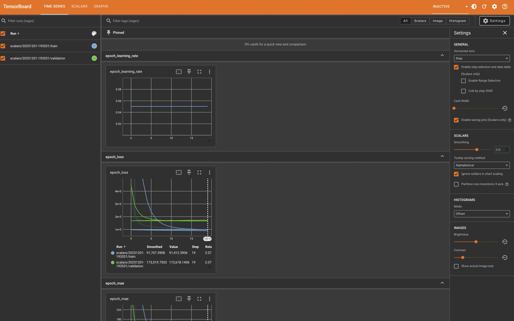
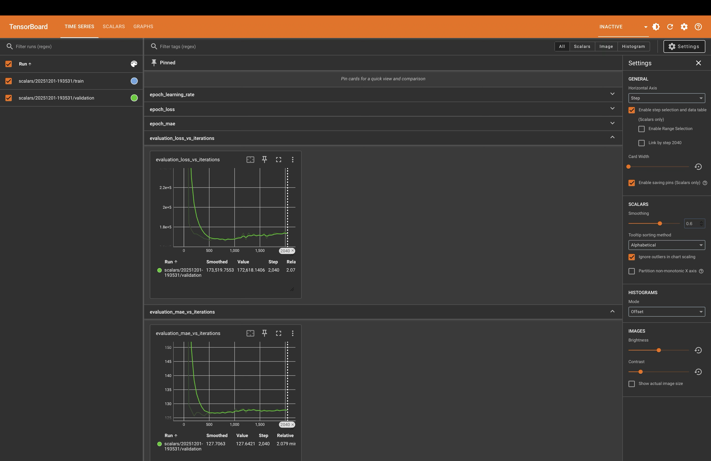
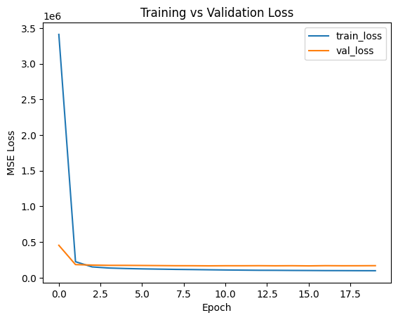

# TensorBoard Lab: Formula 1 Fastest Lap Prediction 🏎️

## Lab Overview

A comprehensive machine learning lab demonstrating **TensorBoard** for monitoring, visualizing, and debugging neural network training using real **Formula 1 race data**.  

This lab builds an end-to-end regression pipeline that:

- Predicts the **fastest lap time (seconds)** for drivers based on race features
- Tracks training metrics using **TensorBoard**
- Visualizes **model architecture, weight distributions, and training curves**
- Uses real-world F1 race data for realism and variability

**Dataset:** ~2,000 race records, features include driver, team, grid position, and laps.  
**Model:** Feedforward Neural Network (3 layers)  
**Primary Metric:** Mean Absolute Error (MAE)  

## Setup Instructions

```bash
# Install dependencies
pip install tensorflow pandas scikit-learn matplotlib numpy

# Launch Jupyter Notebook and run the lab
jupyter notebook F1_TensorBoard_Lab.ipynb

# In Notebook, start TensorBoard
%load_ext tensorboard
%tensorboard --logdir logs/
```
## Changes Made to the Lab

* **Dataset**: Replaced synthetic linear/quadratic data with real F1 race dataset (~2,000 records)
* **Feature Selection**:
  - Selected `grid`, `laps`, `driverId`, `constructorName` as input features
  - Target: `milliseconds` converted to seconds
* **Preprocessing**:
  - Filled missing numeric values with mean
  - One-hot encoded categorical features (`driverId`, `constructorName`) with `handle_unknown='ignore'`
  - StandardScaler applied to numeric columns (`grid`, `laps`)
* **Model Architecture**:
  ```text
  InputLayer(shape=(num_features,))
  Dense(32, activation='relu')
  Dense(16, activation='relu')
  Dense(1)  # regression output
  ````
* **Optimizer**: Adam (`learning_rate=0.05`) instead of SGD
* **Visualization**: Added Matplotlib plots for training vs validation loss
* **TensorBoard**:

  * Scalars: Track loss & MAE per epoch
  * Graphs: Model structure
  * Histograms: Weight and bias distributions
  * Debugger: Alerts summary (optional)

## Dataset
**Source:** [Formula 1 Race Data on Kaggle](https://www.kaggle.com/datasets/jtrotman/formula-1-race-data)  

**Features Used:**
- `grid` (starting grid position)
- `laps` (number of laps in the race)
- `constructorName` (team, one-hot encoded)
- `driverId` (driver, one-hot encoded)

**Target Variable:**
- `milliseconds` (fastest lap time in milliseconds, converted to seconds)

**Preprocessing:**
- Fill missing numeric values with mean
- StandardScaler for numeric columns
- OneHotEncoder for categorical columns
---

## Model Training

**Training Configuration:**

* Batch size: Full dataset (for simplicity)
* Epochs: 20
* Loss: Mean Squared Error (MSE)
* Metric: Mean Absolute Error (MAE)

**Example Callback:**

```python
tensorboard_callback = keras.callbacks.TensorBoard(log_dir=logdir)
```

## Visualization

The TensorBoard dashboards include:

* **Scalars:** Track training & validation loss per epoch
* **Graphs:** View model architecture
* **Histograms:** Observe weight and bias distributions
* **Distributions:** See how tensors change during training
* **Debugger (optional):** Alerts and tensor anomalies





Additionally, a **Matplotlib plot** shows training vs validation loss curves for quick reference.


---

## Observations

* The model captures non-linear patterns in race data
* Drivers, teams, and race conditions introduce realistic variability
* TensorBoard helps monitor training stability, detect anomalies, and visualize model evolution